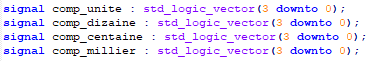
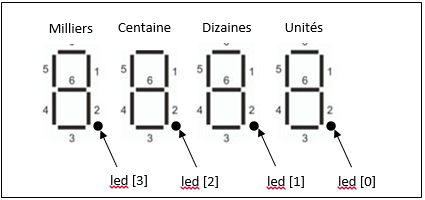

# Documentation fr

|UNIVERSITE DES SCIENCES ET DE LA TECHNOLOGIE D'ORAN MOHAMED BODIAF DEPRATEMENT D'ELECTRONIQUE|
| :-: |
|Rapport du projet FPGA/VHDL|
|Réalisation d'un fréquencemètre numérique à base de FPGA|
||
|

**Travail réalisé par :**

**LEHBAB M'hamed**

**AARIZOU Amina**
|
|

**M1 ESE**

**Année 2018/2019**
|

||
| :- |

**

1. **Introduction :**

Un fréquencemètre est un instrument de mesure destiné à afficher la fréquence d’un signal périodique. Dans un fréquencemètre numérique, on compte le nombre de cycles qu'il y a pendant un intervalle de temps. Si on compte le nombre de cycle en 1 seconde, on aura par définition la fréquence en Hertz.

Un fréquencemètre est essentiellement caractérisé par : sa plage de fréquences, sa précision, sa résolution, c'est-à-dire le nombre de digits affichés, et sa sensibilité, c'est-à-dire la tension ou la puissance minimale requise.

Dans ce projet nous allons réaliser un fréquencemètre numérique multi-calibre à base du circuit logique programmable FPGA, avec les caractéristiques suivantes:

- Une plage de fréquence variant de 1Hz à 100 MHz;
- Une précision de ±1Hz;
- Une résolution de 4 digits;
- Ne tolère que des signaux logiques à deux états (0 à 5 V).
- Dispose de trois calibres: Hertz (Hz), kilohertz (kHz) et mégahertz (MHz).
- Un bouton Reset qui permet réinitialiser le système.  

1. **Principe de fonctionnement d'un fréquencemètre :**

Un fréquencemètre est principalement un compteur d'impulsions du signal entrant. La mesure peut se faire par trois manières différentes :

- Soit en comptant les impulsions issues de l'entrée dans un temps donné (correspondant à un nombre déterminé de périodes de la base de temps). On obtient directement la fréquence.
- Soit en comptant le nombre de périodes de la base de temps dans l'intervalle entre un nombre déterminé d'impulsions issues du signal d'entrée. On obtient un multiple de la période du signal à mesurer, à partir duquel il faut calculer la fréquence.
- Soit, indirectement, en mélangeant un signal dérivé des transitions caractéristiques à un autre, de fréquence proche, constitué à partir de la base de temps, et en mesurant ensuite, par l'un ou l'autre des moyens précédents, la fréquence des battements qui s'ensuivent.

Dans notre projet nous allons nous pencher sur la première méthode de calcul, car celle-ci permet d'obtenir directement la valeur de la fréquence, en comptant le nombre d'impulsions du signal d'entrée pendant une durée d'une seconde, sans avoir à effectuer d'autres calculs. Pour ce faire, nous allons suivre les étapes suivantes :

1. Générer un signal de durée une seconde ;
1. Créer un compteur BCD qui s'incrémente aux fronts montants du signal d'entrée, et ce pendant l'état haut du signal une seconde;
1. Mémoriser la valeur du compteur à chaque front descendant du signal une seconde, puis l'afficher sur quatre afficheurs 7 segments. 

La figure suivante représente le schéma synoptique du fréquencemètre :

**Figure  SEQ Figure \\* ARABIC 1. Schéma synoptique du fréquencemètre**

**Figure  SEQ Figure \\* ARABIC 1. Schéma synoptique du fréquencemètre**

1. **Implémentation et description VHDL :**

Dans cette partie nous allons présenter les détails de la réalisation et de l'implémentation de la description VHDL sur la carte FPGA. Nous allons expliquer chaque partie du projet, et nous allons enfin présenter en annexe 1 et 2, la description VHDL de l'entité principale que l'on appellera **Projet\_frequencemetre**, et des entités secondaires.

Afin de réaliser notre fréquencemètre, nous allons utiliser la carte à base du circuit logique programmable Altera Cyclone II EP2C20, 1 bouton poussoir pour le Reset, 2 switches pour contrôler les calibres, 4 LED rouges pour afficher la virgule, et 4 afficheurs 7 segments pour afficher les compteurs BCD de fréquence. Nous allons synchroniser le système par l'horloge interne du FPGA qui a une fréquence de 50MHz.

1. Génération du signal une seconde: 

Afin de générer un signal interne de durée d'une seconde **une\_sec** nous créons  compteur interne **comp\_une\_sec** qui s'incrémente à chaque front montant de l’horloge interne H du système qui a une fréquence de 50MHz. Pour avoir une durée d'une seconde, il faut incrémenter le compteur jusqu'à la valeur 50000000.
Le signal **une\_sec**, va permettre de contrôler le comptage du nombre d'impulsion du signal d'entrée et d'affecter les résultats. Voir annexe 1.

1. Compteurs BCD:

Pour réaliser notre compteur d'impulsion dont les sorties évoluent entre 0 et 9999. Il était nécessaire d’utiliser 4 compteurs BCD sous forme de signaux internes :

Le compteur dizaine est incrémenté de 1 lorsque le compteur unité passe de 9 à 0. Idem pour le compteur centaine qui s’incrémente lorsque les compteurs unité et dizaine valent 9. Le compteur millier est incrémenté lorsque les compteurs unités, dizaines et centaines sont tous à 9 (Voir annexe).

1. Mémorisation :

Cette partie concerne la mémorisation des valeurs des compteurs avant l'affichage. Afin de ne pas afficher les variations des compteurs lors de leur incrémentation, de 0 à la valeur maximale, nous devons créer 4 signaux internes **s\_latch\_1; s\_latch\_2, s\_latch\_3, et s\_latch\_4  de taille 4 bits**, qui sont réinitialisé respectivement aux valeurs des compteurs **comp\_unite, comp\_dizaine, comp\_centaine et comp\_millier**  à  chaque front descendant du signal une\_sec, et qui mémorisent leurs états ailleurs, ces signaux sont envoyés au décodeur BCD/7segments, pour être affiché (Voir annexe) . 

Le tableau suivant présente la table de vérité du circuit de mémorisation:

|Signal une\_sec|Signal s\_latch (sur 4 bits)|Etat|
| - | - | - |
|0|s\_lath|Mémorisation de l'état précédent|
|1|s\_latch|Mémorisation de l'état précédent|
|Front montant (         )|s\_latch|Mémorisation de l'état précédent|
|Front descendant()  |compteur|Recopie|
**       

` `**Tableau  SEQ Tableau \\* ARABIC 1. Table de vérité du circuit de mémorisation**

1. Affichage (entité BCD):

Cette partie concerne l'entité d'affichage et du décodage BCD/7segments.

La carte sur laquelle nous travaillons, dispose da quatre afficheurs 7 segments, nous allons donc tous les exploiter pour afficher les valeurs des quatre signaux s\_latch issus du circuit de mémorisation.

Comme les valeurs des signaux s\_latch sont codées en BCD sur 4 bits, il est nécessaire de les convertir en code sur 7 bits qui correspond à l'afficheur 7 segment, selon la table suivante (dans ce cas on considère les afficheurs à anode commune : l'envoi d'un 0 implique l'allumage du segment).

L'entité responsable du décodage et de l'affichage est appelée **BCD**, elle prend en entrée un signal **E** sur 4 bits, et renvoie en sortie un signal **S** sur 7 bits qui est envoyé à l'afficheur 7 segments. Pour appeler cette entité dans l'entité principale **Projet\_fréquencemètre**, on prend comme entrée le signal interne **s\_latch**, et comme sortie le signal **seg** (Voir annexe).

- Pour le dernier cas de l'affichage, c'est-à-dire, dans le cas ou la valeur de l'entrée E dépasse 9, on affiche la lettre E, pour signaler une erreur.

|Entrée sur 4 bits|Sortie sur 7 bits|
| - | - |
|0000 = (0)10|0000001 = (01) 16|
|0001 = (1) 10|1001111 = (4F) 16|
|0010 = (2) 10|0010010 = (12) 16|
|0011 = (3) 10|0000110 = (06) 16|
|0100 = (4) 10|1001100 = (4C) 16|
|0101 = (5) 10|0100100 = (24) 16|
|0110 = (6) 10|1100000 = (60) 16|
|0111 = (7) 10|0001111 = (0F) 16|
|1000 = (8) 10|0000000 = (00) 16|
|1001 = (9) 10|0001100 = (0C) 16|
**Tableau  SEQ Figure \\* ARABIC 2. Table de conversion BCD/7 segments**

1. Gestion de calibres:

Dans cette partie nous allons traiter la gestion des calibres du fréquencemètre.

La carte que nous utilisons ne dispose que de 4 afficheurs 7 segments, on ne peut donc afficher que quatre digits, soit de 1 Hz à 9999Hz ce qui représente une gamme de fréquence assez restreinte, afin d'élargie cet intervalle, nous ajoutons la possibilité de changer de calibre. Nous allons donc introduire un calibre pour les KHz et un autre pour les MHz, l'activation d'un des deux calibres se fait à l'aide de deux switches, dont les valeurs sont lues par les signaux d'entrée calibre\_kh (pour les KHz) et calibre\_mhz (pour les MHz). Si aucun calibre n'est activé, le comptage se fait par défaut en hertz. Nous allons aussi utiliser en guise de virgules 4 LED's contrôlées par un signal interne à quatre bits que l'on nomme **led**, et qui sera aussi mémorisé par le circuit de mémorisation dans le signal **s\_latch** puis envoyé en sortie sur les LED's.**   

La figure suivante présente le positionnement des LED's:

**Figure  SEQ Figure \\* ARABIC 3. Positionnement des LED's par rapport aux afficheurs 7 segments**

**Figure  SEQ Figure \\* ARABIC 3. Positionnement des LED's par rapport aux afficheurs 7 segments** 

La gestion des calibres va se faire selon la manière suivante:

- Si aucun calibre n'est activé on compte de 0001.Hz à 9999. Hz: 
- ` `la led 0 est allumée: led = "0001",
- ` `les compteurs unités, dizaines, centaines et milliers sont incrémentés pour chaque front montant de Ve jusqu'à la valeur 9999, si la valeur dépasse, on éteint les leds et on affiche la lettre E, pour indiquer que la valeur de la fréquence du signal d'entrée dépasse la valeur maximale pour ce calibre.
- Si le calibre KHz est activé et que les leds sont éteintes, on compte de 0.001 KHz à 9.999 KHz:
- On met led = "0100",
- les compteurs unités, dizaines, centaines et milliers sont incrémentés pour chaque front montant de Ve jusqu'à la valeur 9999, si la valeur dépasse, on met les milliers à 1 et les autres compteurs à 0, et on décale la virgule en mettant led = "0100", pour passer à 10.00 KHz.
- Si le calibre KHz est activé et que led = "0100", on compte de 10.00 KHz à 99.99KHz:
- Dans ce cas le compteur unité représente les dizaines, il faut donc  l'incrémenter par 10 au lieu de 1, on ajoute donc un autre compteur que l'on appelle **compteur\_10** qui s'incrémente aux fronts montants de Ve, et lorsque compteur\_10 atteigne 9, on incrémente le compteur unité de 1;
- Les compteurs sont ensuite incrémentés comme précédemment jusqu'à atteindre 9999, si cette valeur est dépassée, on met les milliers à 1 et les autres compteurs à 0, et on décale la virgule en mettant led = "0010", pour passer à 100.0 KHz.
- On procède de la même manière pour les autres cas et pour le calibre des MHz, en utilisant les compteurs: compteur\_100, compteur\_1000 et compteur\_1000, jusqu'à atteindre la valeur maximale de 99.99MHz. Si la valeur de la fréquence dépasse les 99.99MHz, on affiche Erreur, pour dire que la fréquence du signal dépasse la plage du fréquencemètre.

4. **Simulation sur Quartus:**

Afin de tester le bon fonctionnement du fréquencemètre avant de passer à l'exécution sur la carte, nous simulons notre description sur Quartus.

Nous faisons deux testes pour deux différentes fréquences: 100Hz, 100Khz.

Pour pouvoir simuler, il est nécessaire de mettre l'horloge interne H à 1kHZ.

- **Pour FVe = 100Hz, calibre Hz:**

La figure 3 représente le résultat de la simulation.

Nous remarquons que :

 * Les  compteurs unités, dizaines, centaines et millier s'incrémentent à chaque impulsion de Ve jusqu'à la valeur de 100 à la fin de la seconde.

Figure 3. Résultat de la simulation pour 100Hz, calibre Hz**

* Au front descendant de la seconde, led\_out = "0001" (1ère  led est allumée), et les afficheurs prennent les valeurs (en hexa) : 01 4f 01 01 qui correspond à l'affichage de  0100. Hz.

- **Pour FVe = 100KHz, calibre KHz:**

La figure 4 représente le résultat de la simulation.

Nous remarquons que :

* Au front descendant de la seconde, led\_out = "0010" (2ème led est allumée), et les afficheurs prennent les valeurs (en hexa) : 4f 01 01 01 qui correspond à l'affichage de  100.0 kHz.

Figure 2. Résultat de la simulation pour 100KHz, calibre KHz**

5. **Conclusion générale :**

A l'issu de ce travail, nous avons réalisé un fréquencemètre numérique à base de circuit logique programmable FPGA, à quatre digits capable de mesurer des fréquences comprises entre 1Hz et 100MHz.

Pour cela, nous avons étudié le principe de fonctionnement d'un fréquencemètre numérique, puis nous avons détaillé les fonctions nécessaires pour son implémentation sur la carte FPGA.

` `En premier lieu, nous avons générer un signal de durée une seconde qui permet, selon son état de contrôler les autres signaux.

En second lieu, nous avons créé les compteurs BCD, qui permettent de  compter le nombre d'impulsions du signal d'entrée auquel nous souhaitons mesurer la fréquence. Nous avons ensuite mémorisé et décodé les valeurs du compteur, pour pouvoir enfin les afficher sur les afficheurs 7 segments. 

Après avoir traduit notre schéma synoptique en description VHDL, nous avons vérifié son fonctionnement en le simulant sur le logiciel Quartus, pour différentes fréquences du signal Ve. En définitive, nous sommes passés à l'exécution sur la carte.  

**ANNEXE** 

**Description VHDL** 

` `PAGE   \\* MERGEFORMAT 9

